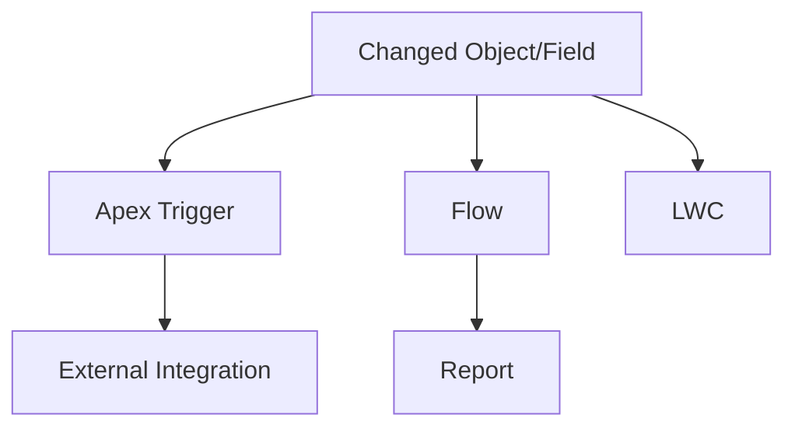

# Impact Assessment: {Change Name}

| Field | Value |
|---|---|
| Version | 1.0 |
| Date | YYYY-MM-DD |
| Author | {Name / Role} |
| Status | Draft / In Review / Approved |
| Jira | [{KEY-123}]({jira-url}) |
| Confluence | [{Page Title}]({confluence-url}) |
| Last Reviewed | YYYY-MM-DD |
| Template Version | 1.0 (2026-04-27) |

---

## 1. Executive Summary

{3-5 sentences: what change is proposed, blast radius (Low / Medium / High), critical risks, and recommended go / no-go / conditional-go.}

**Overall risk:** 🔴 High / 🟡 Medium / 🟢 Low
**Recommendation:** Proceed / Proceed with mitigations / Defer / Reject

## 2. Scope

**Change type:** {Object rename / field deprecation / migration / new integration / refactor / other}

**In scope:**
- {Object/field/class/LWC 1}
- {Object/field/class/LWC 2}

**Out of scope:**
- {Item 1 — and why}
- {Item 2}

**Target org(s):** {DevInt / SIT / UAT / Prod — and which is affected first}

## 3. Affected Components

| Component Type | API Name | Usage | Risk |
|---|---|---|---|
| Apex Class | {ClassName} | {N references} | {High/Medium/Low} |
| Apex Trigger | {TriggerName} | {Direct/indirect} | {High/Medium/Low} |
| Flow | {FlowName} | {Active in prod} | {High/Medium/Low} |
| LWC | {componentName} | {N pages} | {High/Medium/Low} |
| Report / Dashboard | {ReportName} | {Used by {N} users} | {High/Medium/Low} |
| Integration | {NamedCredName / MuleSoft API} | {Inbound/Outbound} | {High/Medium/Low} |
| Permission Set | {PermSetName} | {Assigned to {N} users} | {High/Medium/Low} |

{Include a dependency diagram if the change ripples through multiple layers.}

## 4. Risk Analysis

| Risk | Likelihood | Impact | Mitigation |
|---|---|---|---|
| {Risk 1 — e.g., breaks integration callback} | High | High | {Mitigation} |
| {Risk 2 — e.g., report formula fails} | Medium | Low | {Mitigation} |
| {Risk 3 — e.g., user permission drift} | Low | Medium | {Mitigation} |

**Governor-limit or performance risk:** {Any SOQL row-count, async job, or callout pattern that changes behavior under load}

**Data migration risk:** {Volume, downtime, rollback path}

**Security risk:** {Sharing model, FLS, guest user exposure, PII handling}

## 5. Testing Scope

**Unit tests to add or modify:**
- {Test class 1}
- {Test class 2}

**Integration tests:**
- {Scenario 1 — e.g., POS stay event end-to-end}
- {Scenario 2}

**UAT scenarios:**
- {Scenario 1}
- {Scenario 2}

**Regression suite:**
- {Components to re-run}

**Performance / load tests:** {Required? Volume targets?}

## 6. Deployment Notes

**Deployment order:**
1. {Metadata dependency}
2. {Code that depends on the above}
3. {Data migration script, if any}
4. {Post-deploy validation}

**Rollback strategy:**
{What does rollback look like? Metadata-only change — revert commit + redeploy. Data migration — restore from backup. Irreversible (e.g., field deletion that loses data) — call it out explicitly.}

**Environments & sequence:** DevInt → SIT → UAT → Stage → Prod, with {N} day soak at each stage.

**CAB / approvals required:** {Yes/No — who approves at which gate}

## 7. References

- [Jira epic / parent ticket]({url})
- [Confluence requirements page]({url})
- [Related Solution Design — `docs/Solution_Design_*.md`]({path})
- [Salesforce doc — {topic}]({url})

---

*Document adheres to `.cursor/rules/doc-standards-rule.mdc` Impact Assessment standard and the template in `.cursor/skills/sf-doc-standards-skill/`.*
