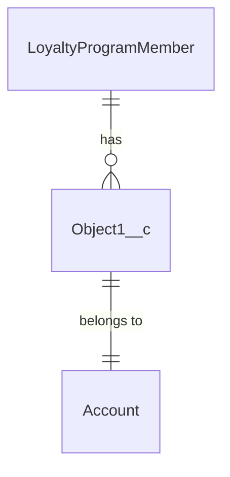
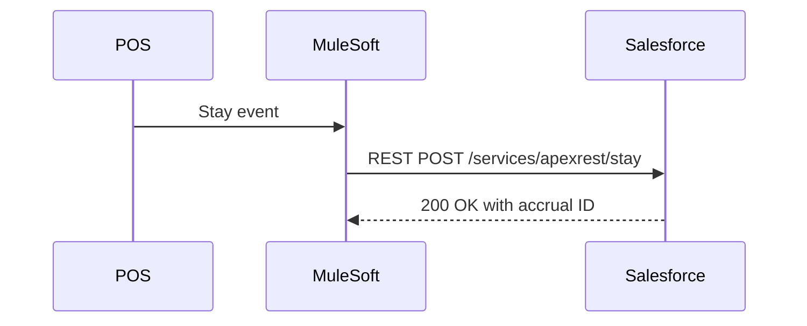

# Solution Design: {Feature Name}

| Field | Value |
|---|---|
| Version | 1.0 |
| Date | YYYY-MM-DD |
| Author | {Name / Role} |
| Status | Draft / In Review / Approved / Superseded |
| Jira | [{KEY-123}]({jira-url}) |
| Confluence | [{Page Title}]({confluence-url}) |
| Last Reviewed | YYYY-MM-DD |
| Template Version | 1.0 (2026-04-27) |

---

## 1. Problem Statement

{One to three sentences: what problem are we solving and why now? Tie to business driver or pain point.}

## 2. Assumptions

- {Assumption 1 — call out data volumes, user counts, licensing, integration topology}
- {Assumption 2}
- {Assumption 3}

## 3. High-Level Design

{One-paragraph overview. Then the architecture diagram.}

## 4. Design Options

### Option A: {Name}

**Approach:** {1-2 sentence summary}

**Pros:**
- {Pro 1}
- {Pro 2}

**Cons:**
- {Con 1}
- {Con 2}

**Governor-limit considerations:** {SOQL, DML, heap, CPU, callout limits that constrain this option}

**Licensing / entitlement:** {Any paid features required — Platform Events high volume, Shield, Bulk API 2.0 ingest, Loyalty Management licenses}

**Documentation references:**
- [Reference 1]({url})
- [Reference 2]({url})

### Option B: {Name}

{Same structure as Option A}

### Option C: {Name — optional third option}

{Same structure}

## 5. Recommendation

**Recommended option:** Option {A/B/C}

**Rationale:** {2-4 sentences explaining why, covering: business fit, technical fit, operational cost, risk. Acknowledge what the rejected options do better so the reader sees you evaluated them fairly.}

## 6. Data Model Changes

| Object | Change Type | Details |
|---|---|---|
| {Object1__c} | New custom object | {Purpose, key fields} |
| {LoyaltyProgramMember} | Add field | {Field_API_Name__c} — {type, purpose} |
| {Object2} | Relationship change | {Lookup → Master-Detail, why} |

{Include an ER diagram if the data model changes are non-trivial.}

## 7. Integration Points

| System | Direction | Mechanism | Frequency | Volume |
|---|---|---|---|---|
| {POS} | Inbound | REST API → Apex REST | Near real-time | {10K events/day} |
| {Downstream} | Outbound | Platform Event | On accrual | {~1M events/month} |

{Include sequence diagram for the primary integration flow.}

## 8. Governor Limit Considerations

| Constraint | Budget | Expected Load | Headroom |
|---|---|---|---|
| SOQL queries per transaction | 100 | {25 per accrual} | Safe |
| DML statements per transaction | 150 | {5 per accrual} | Safe |
| Heap size | 6 MB sync / 12 MB async | {~300 KB per accrual} | Safe |
| Platform Event publish rate | {org entitlement} | {~40 events/sec peak} | {Verify entitlement} |
| Bulk API daily batches | {org entitlement} | {N/A — not using} | — |

## 9. Org Verification Required

Before implementation, verify in the target org:
- [ ] Object `{Object_API_Name}` exists with expected fields
- [ ] Feature `{Feature_Name}` (e.g., Platform Cache, Shield PE, Loyalty Management) is licensed
- [ ] Permission set `{PermSet_Name}` grants the required access
- [ ] Named Credential `{NC_Name}` exists with correct target endpoint
- [ ] Outbound IP allowlisting for {external-system-domain} is configured (if callouts)

## 10. Implementation Sequence

1. {Metadata prerequisites — custom fields, permission sets}
2. {Integration plumbing — Named Credential, Connected App}
3. {Core Apex — handler class, trigger, test class}
4. {LWC / UI changes — component, wire, aura (if any)}
5. {Automation — flow, process builder migrations}
6. {Tests — unit, integration, UAT}
7. {Rollout — sandbox deploy order, prod cutover}

## 11. References

- [Salesforce doc — {topic}]({url})
- [Architect decision guide — {topic}]({url})
- [Well-Architected — {pillar}]({url})
- {Jira epic or parent ticket}
- {Confluence parent page}

---

*Document adheres to `.cursor/rules/doc-standards-rule.mdc` Solution Design standard and the template in `.cursor/skills/sf-doc-standards-skill/`.*
