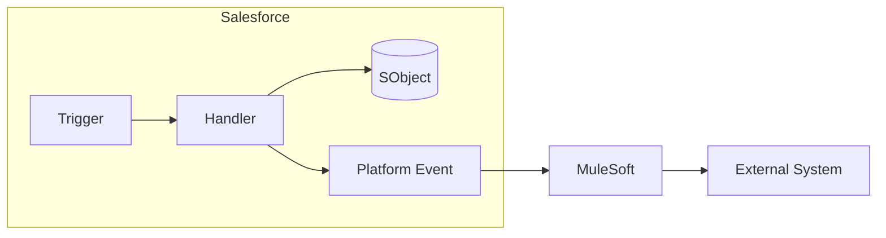
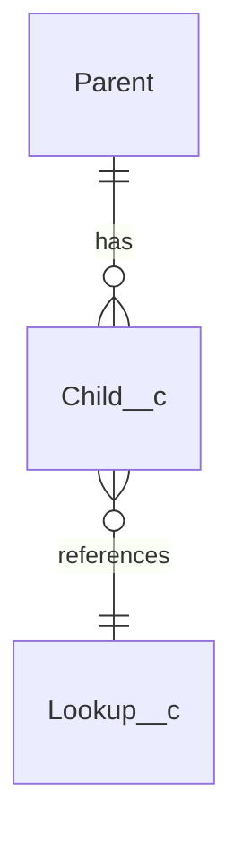
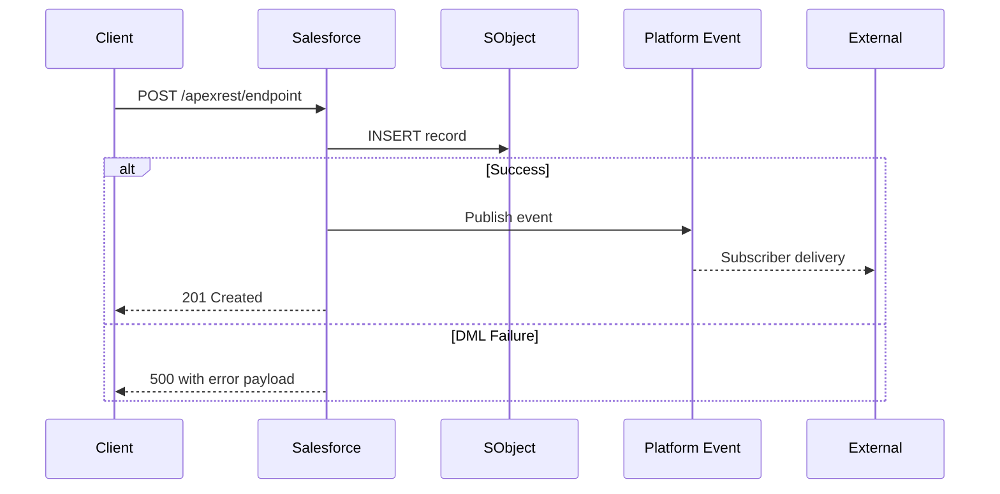

# Technical Design: {Feature / Component Name}

| Field | Value |
|---|---|
| Version | 1.0 |
| Date | YYYY-MM-DD |
| Author | {Name / Role} |
| Status | Draft / In Review / Approved / Implemented |
| Jira | [{KEY-123}]({jira-url}) |
| Confluence | [{Page Title}]({confluence-url}) |
| Related Solution Design | `docs/Solution_Design_{Feature}_v1.md` |
| Last Reviewed | YYYY-MM-DD |
| Template Version | 1.0 (2026-04-27) |

---

## 1. Problem Statement

{Restate the business problem and the Solution Design recommendation that this Technical Design implements. Keep to 2-4 sentences.}

## 2. Assumptions

- {Assumption 1}
- {Assumption 2}
- {Constraints inherited from Solution Design}

## 3. High-Level Design

{One paragraph + architecture diagram showing the technical boundaries: which components, which services, where data flows.}



## 4. Component Design

### 4.1 Apex Classes

| Class | Type | Purpose | Access |
|---|---|---|---|
| `{HandlerName}` | Trigger Handler | {Implements ITriggerHandler} | `public with sharing` |
| `{ServiceName}` | Service / Business Logic | {Encapsulates business rules} | `public with sharing` |
| `{SelectorName}` | Selector (SOQL) | {Centralizes SOQL for {Object}} | `public with sharing` |
| `{ApexRestName}` | REST Endpoint | {Path: /apexrest/{name}} | `global with sharing` |
| `{BatchName}` | Batchable | {Async processing of {scope}} | `public with sharing` |
| `{Test classes}` | Test | {@TestSetup + bulk + negative} | `@isTest` |

### 4.2 LWC Components

| Component | Purpose | Parent | Data Access |
|---|---|---|---|
| `{componentName}` | {Renders X} | {Record page / App page} | LDS `@wire` / GraphQL `@wire(graphql)` / imperative Apex |

### 4.3 Metadata

| Metadata Type | Name | Purpose |
|---|---|---|
| Custom Object | `{Object__c}` | {Purpose} |
| Custom Field | `{Field__c}` on {Object} | {Type, required, external ID} |
| Platform Event | `{Event__e}` | {Producers, consumers, replayId strategy} |
| Named Credential | `{NC_Name}` | {Target endpoint, auth protocol} |
| Permission Set | `{PermSet_Name}` | {Personas, object/field access} |
| Flow | `{FlowName}` | {Trigger type, entry criteria} |

### 4.4 Data Model Changes



{Field-level detail in table form:}

| Object | Field | Type | Required | External ID | Description |
|---|---|---|---|---|---|
| {Object__c} | Field1__c | Text(255) | Yes | Yes | {Purpose} |
| {Object__c} | Field2__c | Lookup({Related}) | No | No | {Purpose} |

## 5. Integration Design

{Detailed sequence for each integration flow, with failure paths.}



**Error handling:**
- {Retry strategy — if retriable, use exponential backoff; if not, write to exception table}
- {Dead letter pattern — where failed messages go}
- {Idempotency key — how duplicate requests are detected}

**Authentication:**
- {OAuth 2.0 client credentials / named principal / per-user / named credential auth provider}

## 6. Automation / Trigger Framework

{One-trigger-per-object compliance confirmation. Show handler wiring.}

```
Trigger: {Object}Trigger.trigger
  ↓
GenericTriggerDispatcher.dispatch(this)
  ↓
{HandlerName} implements ITriggerHandler
  ↓
Methods called per event: beforeInsert / afterInsert / beforeUpdate / ...
```

**Recursion guards:** {TriggerContext static flag / SObject-level flag / none}

**Bypass mechanism:** {Custom setting / custom permission for admin/integration users}

## 7. Security Design

**Sharing:** {with sharing / inherited / custom}

**FLS / CRUD enforcement:** {`Security.stripInaccessible` / `WITH SECURITY_ENFORCED` / explicit `isAccessible()` checks}

**PII / sensitive data:** {Fields flagged as Shield-encrypted, classification tags, retention policy}

**Permission set composition:** {Base permset + feature permsets + integration user permset}

**Guest user access:** {Explicit callout if any — e.g., "No guest user access to this data"}

## 8. Governor Limit Analysis

| Limit | Budget | Expected Usage | Headroom |
|---|---|---|---|
| SOQL queries (sync) | 100 | {N} | {Safe / Tight / At risk} |
| DML statements (sync) | 150 | {N} | {Safe / Tight / At risk} |
| SOQL rows (sync) | 50,000 | {N} | {Safe / Tight / At risk} |
| Heap (sync) | 6 MB | {~N MB} | {Safe / Tight / At risk} |
| CPU time (sync) | 10,000 ms | {~N ms} | {Safe / Tight / At risk} |
| Callout limit | 100 per transaction | {N} | {Safe / Tight / At risk} |
| Future calls | 50 | {N} | {Safe} |
| Queueable chain depth | {org entitlement} | {N} | {Safe} |

**Bulkification:** {Trigger processes up to 200-record batch; Batch Apex uses scope size {N}; Platform Event consumer uses {EventBus.MAX_BATCH_SIZE} triggers}

## 9. Test Strategy

**Unit tests:**
- `@TestSetup` creates {N} parent records, {N} child records
- Positive: single insert, bulk insert of 200, bulk update of 200
- Negative: null FK, invalid field value, duplicate external ID
- Security: `runAs` with low-privilege user asserts FLS gate

**Integration tests:**
- {Named Credential mock / HttpCalloutMock}
- {Platform Event publish/consume pair}

**Coverage target:** 85% line coverage minimum, 100% for business-logic methods.

**Performance test (if LDV):** {Apex anonymous script loading {N} records, measuring query time and CPU}

## 10. Deployment Plan

**Deployment order (per environment):**
1. {Custom objects, fields}
2. {Permission sets}
3. {Named credentials}
4. {Apex classes (dependencies first)}
5. {Triggers}
6. {LWC components}
7. {Flows}
8. {Post-deploy data migration script (if any)}

**Post-deploy validation:**
- [ ] Apex tests pass in target org (≥85%)
- [ ] Integration smoke test: {specific command}
- [ ] Dashboard / report render as expected
- [ ] Permission set assigned to {N} pilot users

**Environment progression:** DevInt → SIT → UAT → Stage → Prod, with {N} day soak between stages.

**Rollback:**
- {For code: revert commit + redeploy}
- {For data: restore from pre-deploy backup}

## 11. References

- [Related Solution Design]({path})
- [Jira stories / subtasks]({url})
- [Confluence implementation notes]({url})
- [Salesforce documentation — {topic}]({url})

---

*Document adheres to `.cursor/rules/doc-standards-rule.mdc` Technical Design standard and the template in `.cursor/skills/sf-doc-standards-skill/`.*
