# Salesforce Loyalty Management — Reference

## Object API Versions

For the complete object list with descriptions and per-object Salesforce documentation URLs, see [objects-reference.md](objects-reference.md).

| Object | API Version |
|--------|-------------|
| LoyaltyProgram, LoyaltyProgramMember, LoyaltyLedger, TransactionJournal, Benefit, Promotion, Voucher | 51.0 |
| LoyaltyProgramMemberCase | 52.0 |
| LoyaltyPgmGroupMbrRlnsp | 53.0 |
| LoyaltyAggrPointExprLedger, LoyaltyProgramProcess | 54.0 |
| LoyaltyPgmEngmtAttribute, LoyaltyPgmPartnerCurrency, LoyaltyProgramPartnerLedger, LoyaltyPgmPtnrPrepaidPack | 55.0 |
| LoyaltyProgramBadge, LoyaltyProgramMemberBadge, LoyaltyProgramMemberMerge, LoyaltyPgmMbrPromEligView | 56.0 |
| LoyaltyMembershipLifecycle, LoyaltyProgramWidget | 57.0 |
| GameDefinition, GameParticipant, GameReward, GameParticipantReward, PromotionChannel, PromotionLimit | 60.0 |
| LoyaltyPgmCurrencySubtype, LoyaltyProgramCurrencyTier | 61.0 |
| LoyaltyLedgerTraceability, PromotionActionableList | 62.0 |
| LoyaltyTierMshpFeeOption, LoyaltyTierPromotion | 63.0 |
| LoyaltyTierEligibilitySrc | 64.0 |
| AnalyticsDatasetDefinition, PromotionExecutionEvalGrp, PromotionExecEvalGrpItem | 65.0 |
| DigitalPass, DigitalPassTemplate, DigitalPassTmplParameter, LoyaltyPgmMbrLinkedPtnr | 66.0 |

---

## Core Object Relationships

### Entity Relationship Diagram

```mermaid
erDiagram
    LoyaltyProgram ||--o{ LoyaltyProgramMember : "has members"
    LoyaltyProgram ||--o{ LoyaltyProgramCurrency : "defines currencies"
    LoyaltyProgram ||--o{ LoyaltyTierGroup : "defines tier groups"
    LoyaltyProgram ||--o{ LoyaltyProgramPartner : "has partners"
    LoyaltyProgram ||--o{ Promotion : "runs promotions"
    LoyaltyProgram ||--o{ VoucherDefinition : "defines vouchers"
    LoyaltyProgram ||--o{ Benefit : "offers benefits"
    LoyaltyProgram ||--o{ LoyaltyProgramProcess : "runs processes"
    LoyaltyProgram ||--o{ GameDefinition : "defines games"

    LoyaltyTierGroup ||--o{ LoyaltyTier : "contains tiers"
    LoyaltyTier ||--o{ LoyaltyTierBenefit : "maps benefits"
    LoyaltyTier ||--o{ LoyaltyTierPromotion : "maps promotions"
    LoyaltyTierBenefit }o--|| Benefit : "references"

    LoyaltyProgramMember ||--o{ LoyaltyMemberTier : "current tier"
    LoyaltyProgramMember ||--o{ LoyaltyMemberCurrency : "point balances"
    LoyaltyProgramMember ||--o{ LoyaltyLedger : "ledger entries"
    LoyaltyProgramMember ||--o{ TransactionJournal : "transactions"
    LoyaltyProgramMember ||--o{ MemberBenefit : "assigned benefits"
    LoyaltyProgramMember ||--o{ LoyaltyProgramMbrPromotion : "promotion enrollment"
    LoyaltyProgramMember ||--o{ Voucher : "issued vouchers"
    LoyaltyProgramMember ||--o{ LoyaltyPgmMbrLinkedPtnr : "partner links"
    LoyaltyProgramMember ||--o{ LoyaltyPgmMbrAttributeVal : "engagement values"

    LoyaltyMemberTier }o--|| LoyaltyTier : "references"
    LoyaltyMemberCurrency }o--|| LoyaltyProgramCurrency : "references"

    TransactionJournal ||--o{ LoyaltyLedger : "creates entries"
    TransactionJournal }o--|| JournalType : "categorized by"
    TransactionJournal }o--|| JournalSubType : "subcategorized by"

    LoyaltyProgramPartner ||--o{ LoyaltyProgramPartnerLedger : "partner ledger"
    LoyaltyProgramPartner ||--o{ LoyaltyPgmPtnrPrepaidPack : "prepaid packs"
    LoyaltyProgramPartner ||--o{ LoyaltyPartnerProduct : "partner products"

    Promotion ||--o{ PromotionStage : "has stages"
    Promotion ||--o{ PromotionProduct : "eligible products"
    Promotion ||--o{ PromotionLimit : "limits"

    VoucherDefinition ||--o{ Voucher : "issues vouchers"

    GameDefinition ||--o{ GameReward : "defines rewards"
    GameDefinition ||--o{ GameParticipant : "has participants"
    GameParticipant ||--o{ GameParticipantReward : "earns rewards"

    DigitalPassTemplate ||--o{ DigitalPass : "creates passes"
    DigitalPassTemplate ||--o{ DigitalPassTmplParameter : "has parameters"
```



### Quick Reference (Text)

```
LoyaltyProgram
├── LoyaltyProgramMember (members)
├── LoyaltyProgramCurrency (currencies)
├── LoyaltyTierGroup (tier groups)
│   └── LoyaltyTier (tiers)
├── LoyaltyProgramPartner (partners)
├── LoyaltyProgramProcess (rules engine)
├── Promotion (promotions)
├── VoucherDefinition (voucher definitions)
├── Benefit (benefits)
└── GameDefinition (gamification)

LoyaltyProgramMember
├── LoyaltyMemberTier (current tier)
├── LoyaltyMemberCurrency (point balances)
├── LoyaltyLedger (ledger entries)
├── TransactionJournal (transactions)
├── MemberBenefit (assigned benefits)
├── LoyaltyProgramMbrPromotion (promotion enrollment)
├── LoyaltyPgmMbrLinkedPtnr (partner links)
├── LoyaltyPgmMbrAttributeVal (engagement values)
└── Voucher (issued vouchers)
```

---

## Qualifying vs Non-Qualifying Currency

| Type | Purpose | Example |
|------|---------|---------|
| Qualifying | Engagement; drives tier progression | Stay nights, spend amount |
| Non-qualifying | Redeemable points | Points balance for redemption |

---

## Journal Types

- **Accrual:** Points earned
- **Redemption:** Points spent
- **Adjustment:** Manual corrections
- **Expiration:** Points expired

Use JournalType, JournalSubType, and JournalReason for full categorization.

---

## Partner Models

| Model | Description |
|-------|-------------|
| Prepaid | Partner buys points pack; LoyaltyPgmPtnrPrepaidPack |
| Postpaid | Partner billed for points used; LoyaltyPgmPtnrLdgrSummary |

---

## Loyalty Management Business APIs

Use Apex classes from the Loyalty Management package for programmatic operations instead of raw DML. See [sources.md](sources.md) for the Business APIs documentation URL.

---

## Object Lists and Availability

For the complete categorized object list with descriptions, per-object Salesforce API documentation, and custom objects, see [objects-reference.md](objects-reference.md). For org-verified metadata snapshot, see [org-context.md](org-context.md).

---

## Implementation Patterns

**Do:**
- Use Business APIs over raw DML for loyalty operations
- Use standard invocable actions in Flows when possible
- Bulkify Apex; TransactionJournal and LoyaltyLedger scale with volume
- Use batch processing for high-volume accruals/redemptions
- Prefer Platform Events (e.g., Loyalty_Stay_Event__e) for async integration

**Avoid:**
- SOQL/DML in loops on TransactionJournal or LoyaltyLedger
- Modifying standard object behavior; extend via custom objects/triggers
- Synchronous callouts holding DB connections during loyalty transactions
- Mixing Flow and Apex triggers on the same loyalty object without orchestration

**Governor limits:** SOQL 100/transaction; DML 150 statements, 10,000 rows; bulkify journal and ledger operations; use async (Queueable/Platform Events) for external integrations.

---

## Troubleshooting

| Issue | Action |
|-------|--------|
| Missing object | Use `sf sobject describe -s <Object> -o <alias>` to verify |
| Custom field not found | Check [org-context.md](org-context.md); verify with `sf sobject describe` |
| Invocable action errors | Use standard invocable actions first; reference Business APIs documentation |
| Bulk failures | Ensure bulkification; use batch for high-volume TransactionJournal |
