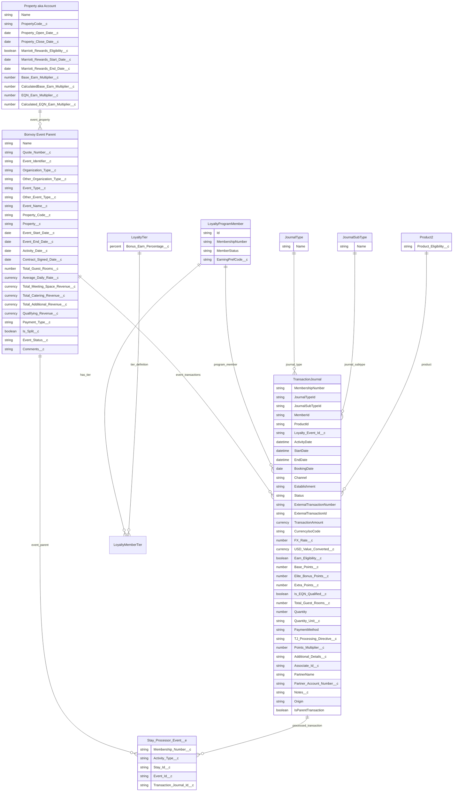
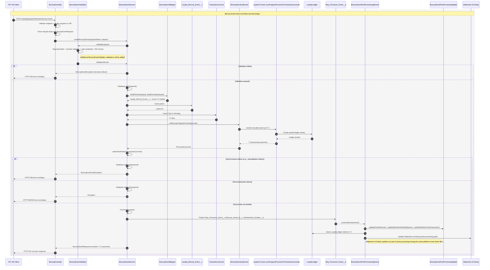

# Marriott Bonvoy Events - CLM Processing Model and Data Design

## 1. Overview

This design defines how Marriott Bonvoy Event transactions should be processed in CLM.

Bonvoy Events are non-stay earning transactions. They should not be routed through the existing Member Stay API because Events have a different transaction shape, rule set, validation model, cap logic, split handling, and post-processing flow.

The recommended solution is to create a dedicated custom Events API that follows the proven orchestration pattern from the Member Stay API, while keeping Event validation, Event earning logic, and Event post-processing separate from Stay processing.

## 2. Scope

Included:

- Event transaction classification
- `JournalType = Accrual`
- `JournalSubType = Events`
- Dedicated Event API
- `Loyalty_Event__c` parent object for Event persistence
- TransactionJournal creation
- Program-level cap and earning configuration
- Eligibility validation
- Split allocation between up to two members
- Points calculation
- EQN calculation
- Exclusion from Ambassador Elite qualifying spend
- Async post-processing for monthly balance and tier assessment

Excluded:

- Promotions beyond double/triple points
- Miles processing
- eBonus implementation
- Changes to existing Stay API behavior

## 3. Final Recommendation

Create a dedicated Bonvoy Events API and use `Loyalty_Event__c` as the standalone Event parent object.

Recommended endpoint:

`POST /services/apexrest/loyalty/{programName}/loyalty/sf-bonvoy-event`

Recommended object model:

- A new `Loyalty_Event__c` record is created for the Event parent.
- Event earning records are created as linked `TransactionJournal` records.
- Event TJs use `JournalType = Accrual` and `JournalSubType = Events`.

Events must not be modeled as Stay records or processed through the existing Member Stay API, Stay validation, or Stay post-processing flow.

## 4. Key Design Decisions

| Decision Area | Final Decision |
|---|---|
| Reuse existing Member Stay API endpoint | No |
| Reuse Member Stay API patterns/utilities | Yes |
| Create Event as `Loyalty_Stay__c` record type | No |
| Create standalone `Loyalty_Event__c` parent | Yes |
| Add `Type = Stay/Event` picklist on Stay | No |
| Event TJ granularity | 1 TJ per earning member |
| Split handling | Separate TJs linked to one Event parent |
| Cap handling | Applied during Event processing |
| Eligibility | Rules Engine / Loyalty Process driven |
| Transaction boundary | All-or-none |
| Post-processing | Reuse async pattern with Event routing |

## 5. Object Model

### 5.1 Event Parent

`Loyalty_Event__c` will be used as the standalone parent object for Bonvoy Events.

The Event parent stores quote/detail-level Event data and groups one or more Event Transaction Journals.

Recommended Event parent fields:

- Quote Number / External Transaction Id
- MARSHA Property Code
- Event Start Date
- Event End Date
- Activity Date
- Contract Signed Date / Booking Date
- Organization Type
- Other Organization Type
- Event Type
- Other Event Type
- Event Name
- Total Guest Room Pickup
- Average Daily Rate
- Meeting Space Revenue
- Catering Revenue
- Additional Revenue
- Qualifying Revenue
- Payment Type
- Split Indicator
- Comments / Notes

### 5.2 Event Transaction Journals

Each earning member receives a separate Event TJ.

For single-member Events:

- Create one `Loyalty_Event__c` parent record.
- Create one linked Event TJ.
- The TJ references the Event parent through `Loyalty_Event_Id__c`.

For split Events:

- Create one `Loyalty_Event__c` parent record.
- Create two linked Event TJs.
- Both TJs reference the same Event parent through `Loyalty_Event_Id__c`.
- Each TJ represents one earning member.
- The request is processed all-or-none.

`TransactionAmount` should represent the qualifying Event revenue used for base point calculation. CLM should calculate this as:

`Meeting Space Revenue + Catering Revenue + Additional Revenue`

For split Events, CLM should allocate the qualifying revenue across the two Event TJs according to the split rule.

### 5.3 Important Guardrail

Event records are stored on `Loyalty_Event__c` because they are not stays.

Event records must not use:

- stay duplicate validation
- overlapping stay validation
- host multiple logic
- back-to-back logic
- CEC stay behavior
- stay total aggregation
- property stay EQN multiplier logic
- loyalty stay event publishing

Events must use:

- Event-specific validation
- Event-specific mapping
- Event-specific earning rules
- Event-specific cap rules
- Event-specific EQN calculation
- Event-specific post-processing route

### 5.4 Data Model ER Diagram



## 6. TJ Mapping Fields

Field-by-field mapping is done in this task:

https://marriottcloud.atlassian.net/browse/LYLT-17848

Based on this design, MI will send one payload to CLM and CLM will separate the earning entries between the primary and secondary members when the Event is split.

## 7. API Design

Recommended endpoint:

`POST /services/apexrest/loyalty/{programName}/loyalty/sf-events`

The API receives Event quote/detail data and one or two earning members.

Example request:

```json
{
  "events": [
    {
      "primaryMember": {
        "memberId": "20982fa3ab9f49ab964a78c6845a1peg.04",
        "partnerName": "United Airline",
        "partnerAccountNumber": "UA-9876334"
      },
      "secondaryMember": {
        "memberId": "20982fa3ab9f49ab964a78c6845a1peg.05",
        "partnerName": "United Airline",
        "partnerAccountNumber": "UA-9876336"
      },
      "journalType": "Accrual",
      "journalSubType": "Events",
      "externalTransactionId": "QN-2026-00441",
      "establishment": "ATLMA",
      "startDate": "2026-07-10",
      "endDate": "2026-07-14",
      "activityDate": "2026-07-14",
      "bookingDate": "2026-04-01",
      "total_Guest_Rooms__c": 50,
      "transactionAmount": 200000,
      "quantity": 1000,
      "quantity_Unit__c": "Points",
      "payment_Type__c": "DIRECT BILL",
      "associate_Id__c": "EID112233",
      "notes": "Here is a comment for the event",
      "organization_Type__c": "INDEPENDENT PLANNER",
      "event_Type__c": "ANNIVERSARY",
      "event_Name": "Annual Leadership Meeting",
      "average_DailyRate": 350,
      "totalMeetingSpaceRevenue": 90000,
      "total_Catering_Revenue__c": 80000,
      "total_AdditionalRevenue": 30000,
      "is_Split__c": true
    }
  ]
}
```

## 8. Processing Flow

1. TIP submits Event payload to the custom Events API.
2. CLM validates the request structure.
3. CLM validates the loyalty program from the URI.
4. CLM validates required Event fields.
5. CLM validates member status and earning preference.
6. CLM validates property by MARSHA/property code.
7. CLM validates split rules.
8. CLM starts a savepoint transaction for all-or-none handling.
9. CLM creates the `Loyalty_Event__c` Event parent record.
10. CLM creates one or more Event TJs in `Pending` status.
11. Apex invokes Loyalty Process for each Event TJ through an Event-specific wrapper.
12. Loyalty Process applies Event earning and cap rules and returns structured processing output.
13. If the output indicates validation failure, CLM rolls back the savepoint and returns a controlled error response.
14. If processing succeeds, Loyalty Process creates LoyaltyLedger entries and CLM commits the transaction.
15. CLM publishes a non-stay post-processing event.
16. CLM returns Event parent Id and TJ-level results to TIP.

## 9. Event Processing Diagram



## 10. Transaction Boundary

The Event request is processed as all-or-none and should be controlled by Apex using a `Database.Savepoint`.

For single-member Events, CLM commits only if the Event parent and Event TJ pass validation and processing.

For split Events, CLM commits only if both members and both TJs pass validation and cap checks.

If either member fails validation, total cap enforcement, or Loyalty Process returns a hard validation failure output, CLM rolls back:

- Event parent
- all Event TJs
- processing side effects within the transaction boundary

This prevents partial split processing and prevents failed Event TJs from being retained when the API response must report a controlled business validation error.

Recommended failure handling pattern:

1. Apex creates the Event parent and pending Event TJ records inside the savepoint.
2. Apex invokes Loyalty Process through an Event-specific wrapper.
3. Loyalty Process executes successfully from a platform perspective.
4. Loyalty Process output indicates whether business validation passed or failed.
5. If the output indicates validation failure, Apex rolls back the savepoint.
6. Apex returns the validation code/message in the Bonvoy Event API response.

## 11. Loyalty Parameters (Program-Level Configuration)

All Event earning and cap values must be read as Loyalty Parameters by the Loyalty Process (no hardcoded constants in Event Apex orchestration).

### 11.1 Configured Loyalty Parameters

| Parameter | Parameter Name | Type | Data Type | Config Key / API Name | Initial Value | Condition | Usage / Rule | Message |
|---|---|---|---|---|---:|---|---|---|
| Base Points Rate | `EventBasePointsPerDollar` | Variable | Number | `EVENT_BASE_POINTS_PER_DOLLAR` | `2` | `EventBasePointsRateLookup` | `BasePointsRaw = TransactionJournal.TransactionAmount * EVENT_BASE_POINTS_PER_DOLLAR` | N/A |
| Base Points Cap | `EventBasePointsCap` | Variable | Number | `EVENT_BASE_POINTS_CAP_SINGLE` | `60000` | N/A | `BasePointsAwarded = MIN(BasePointsRaw, EventBasePointsCap)` | `Reward is over max allowed, so max will be awarded.` |
| Total Points Cap | `EventTotalPointsCap` | Variable | Number | `EVENT_TOTAL_POINTS_CAP` | `200000` | `EventTotalPointsCapLookup` where parameter name = `EVENT_TOTAL_POINTS_CAP` | Reject and rollback if `CalculatedBasePoints + CalculatedEliteBonusPoints + Quantity` exceeds cap. | `Earned Points plus Purchased Points cannot exceed 200,000 points, please adjust Purchased Point Value. Overage: {overageAmount}` |
| Event EQN Cap | `EventEqnCap` | Variable | Number | `EVENT_EQN_CAP` | `20` | N/A | Compare calculated EQN with cap and award the minimum value. | Cap warning may be written to `Notes__c`. |
| Event EQN Room Ratio | `EventEqnRoomRatio` | Variable | Number | `EVENT_EQN_ROOM_RATIO` | `20` | `EventEqnRoomRatioLookup` where parameter name = `EVENT_EQN_ROOM_RATIO` | `RoomsFactor = Loyalty_Event__c.Total_Guest_Rooms__c / EVENT_EQN_ROOM_RATIO` | N/A |

### 11.2 Runtime Lookup and Working Variables

| Parameter | Parameter Name | Type | Data Type | Source / Criteria | Usage |
|---|---|---|---|---|---|
| Loyalty Member Tier Record | `LoyaltyMemberTierRecord` | Lookup | Record | Source object: `LoyaltyMemberTier`. Criteria: Loyalty Program Member = Transaction Journal Loyalty Program Member, Tier Group = `Tiers`, Current Tier = true. | Identifies the member's active tier for tier-based Event earning calculations. |
| Total Guest Room | `EventTotalGuesRoom` | Variable | Numeric, 2 decimals | `Loyalty_Event__c.Total_Guest_Rooms__c` | Used in EQN calculation. |
| Event Earnings Is Split | `EventEarningsisSplit` | Variable | Boolean | `Loyalty_Event__c.Is_Split__c` | Determines whether EQN must be split between two event planners. |
| Calculated Base Points | `CalculatedBasePoints` | Variable | Numeric, 2 decimals | Assigned by `AssignParameterValues`. Formula: `TransactionJournal.TransactionAmount * EventBasePointsPerDollar * BasePointsMultiplierValue`. | Stores promoted base points before/after cap logic. |
| Calculated Elite Bonus Points | `CalculatedEliteBonusPoints` | Variable | Numeric, 2 decimals | Assigned when `IsEliteBonusEligible = true` and `Award Elite Points = true`. | Stores tier-based elite bonus points. |
| Base Points Multiplier Value | `BasePointsMultiplierValue` | Variable | Numeric, 0 decimals | Derived from Event product code: `EVT_BASE = 1`, `EVT_DBL = 2`, `EVT_TRP = 3`. | Used to calculate total base points per member per TJ. |
| Points Cap Reached Warning | `PointsCapReachedWarning` | Variable | Text | Set when points or EQN cap is reached. | Used to update `Notes__c` and API warning response. |

## 12. Event Earning Logic

Qualifying Event revenue is represented by:

`TransactionJournal.TransactionAmount`

CLM calculates this amount as the sum of:

- meeting space revenue
- catering revenue
- additional revenue

Base points formula:

`TransactionJournal.TransactionAmount * EventBasePointsPerDollar * BasePointsMultiplierValue`

For single-member Events:

- one TJ receives the full qualifying amount
- base cap is `60000` using `EVENT_BASE_POINTS_CAP_SINGLE`
- EQN cap is `20`

For split Events:

- CLM creates two TJs, one per member
- qualifying Event revenue is allocated across the two TJs
- base point cap uses `EventBasePointsCap`
- EQN cap is `20` per Event

## 13. Elite Bonus Logic

Elite bonus must be calculated in Loyalty Process using the active `LoyaltyMemberTierRecord`.

Inputs:

- member tier at transaction processing time
- `CalculatedBasePoints`
- tier-level bonus multiplier or bonus earn percentage
- `IsEliteBonusEligible`
- `Award Elite Points`

Formula:

`CalculatedEliteBonusPoints = ROUND((CalculatedBasePoints * LoyaltyMemberTierRecord.Loyalty_Tier__r.Bonus_Earn_Percentage__c) / 100, 0)`

Elite bonus is only calculated when `IsEliteBonusEligible = true` and `Award Elite Points = true`.

## 14. Points Multiplier

The Event product code controls the base points multiplier.

Supported values:

- `EVT_BASE`: `BasePointsMultiplierValue = 1`
- `EVT_DBL`: `BasePointsMultiplierValue = 2`
- `EVT_TRP`: `BasePointsMultiplierValue = 3`

The multiplier is applied during base points calculation:

`CalculatedBasePoints = TransactionJournal.TransactionAmount * EventBasePointsPerDollar * BasePointsMultiplierValue`

## 15. Purchased Bonus Points

Purchased bonus points are submitted through:

- `TransactionJournal.Quantity`
- `TransactionJournal.Quantity_Unit__c = Points`

Purchased bonus points are separate from Event base earning, but they count toward the total Event points cap.

Total points formula:

`TotalPointsToCredit = CalculatedBasePoints + CalculatedEliteBonusPoints + TransactionJournal.Quantity`

If this value exceeds `EVENT_TOTAL_POINTS_CAP`, CLM rejects the full request and rolls back all records.

## 16. EQN Calculation

EQNs are calculated using total guest room pickup.

Formula:

`EventTotalGuesRoom / EventEqnRoomRatio`

Initial rule:

`1 EQN per 20 actualized rooms`

Rounding rule:

- decimal `>= 0.5` rounds up
- decimal `< 0.5` rounds down

For split Events, CLM should allocate EQN across the two event planners and apply a split cap of `EVENT_EQN_CAP / 2`, which is `10` EQN per member when the Event cap is `20`.

For non-split Events, CLM applies the full `EVENT_EQN_CAP`.

If the member reaches the EQN cap, CLM should award the capped value and add a warning to `Notes__c`.

EQN year is derived from:

`TransactionJournal.ActivityDate`

## 17. Spend / EQS Calculation

Bonvoy Event transaction amount may be posted as Event spend for reporting or statement activity if required by CLM reporting.

However, Bonvoy Event spend must not count toward Ambassador Elite qualifying spend.

If a separate qualifying spend currency is used for Ambassador qualification, Event TJs must be excluded from that currency calculation. If Event spend is written to ledger, it should be identifiable as non-Ambassador-qualifying Event spend.

## 18. Loyalty Process Design

Bonvoy Events should follow the same orchestration boundary used by the Member Stay API: Apex owns request orchestration and transaction control, while CLM Loyalty Process owns earning rule execution and ledger posting.

Recommended Event API ownership (Apex orchestration layer, analogous to `MemberStayApi` + `MemberStayService`):

- endpoint and URI validation (including loyalty program extraction/validation)
- request wrapper parsing and typed mapping (`events[]` -> internal request DTOs)
- required-field validation and business pre-validations (member, property, split eligibility)
- `Loyalty_Event__c` parent creation
- Event `TransactionJournal` creation in `Pending` status
- savepoint + rollback handling for all-or-none split processing
- Loyalty Process invocation through an Apex wrapper
- interpretation of Loyalty Process output fields such as validation status, validation code, and validation message
- API-level error mapping and business response payload construction
- publication of non-stay post-processing event after successful processing

Loyalty Process ownership (rules engine and posting layer):

- Event earning rule evaluation by `JournalType` / `JournalSubType`
- base point calculation and base points cap enforcement
- points multiplier application (double/triple)
- elite bonus calculation on capped base points
- purchased bonus point handling from `Quantity` / `Quantity_Unit__c`
- EQN award calculation and EQN cap handling
- `LoyaltyLedger` creation and final currency posting
- structured output values for Event API orchestration, including success/failure, validation code, message, and warning text
- final posted outcome used by downstream post-processing

Invocation pattern reuse from Stay implementation:

- In Member Stay, Apex inserts `TransactionJournal` records in `Pending` status and then calls `MemberStayService.runProgramProcess(...)` to invoke Loyalty Process.
- Bonvoy Events should use the same pattern: create Event TJs in `Pending`, invoke Loyalty Process from Apex service orchestration, and rollback the full request if split/all-or-none validation or cap constraints fail.

### 18.1 Apex Wrapper Around Loyalty Process

Bonvoy Events should use Apex, not Flow, when true transaction control is required. Apex owns the savepoint, creates the `Loyalty_Event__c` parent and pending Event TJs, invokes Loyalty Process, inspects the process output, and decides whether to commit or roll back.

Loyalty Process validation failures should be modeled as controlled business outputs, not unhandled platform exceptions. The Loyalty Process may execute successfully, but still return an output indicating that the Event TJ failed a business rule such as total points cap validation.

Recommended Loyalty Process output fields:

- `isSuccess`
- `validationFailed`
- `validationCode`
- `validationMessage`
- `warningMessage`
- `transactionJournalId`

Recommended control flow:

```text
Apex creates savepoint
->
Apex creates Loyalty_Event__c and pending Event TJ records
->
Apex invokes Loyalty Process
->
Loyalty Process executes successfully
->
Output indicates success or validation failure
->
If validation failed, Apex rolls back the savepoint
->
Apex returns controlled Bonvoy Event API error response
```

Conceptual Apex pattern:

```apex
Savepoint sp = Database.setSavepoint();

try {
    Loyalty_Event__c eventParent = EventMapper.toEventParent(request);
    insert eventParent;

    List<TransactionJournal> eventTjs = EventMapper.toTransactionJournals(request, eventParent.Id);
    insert eventTjs;

    List<EventProcessResult> processResults = EventLoyaltyProcessInvoker.process(eventTjs);

    EventProcessResult failedResult = EventProcessResult.firstHardFailure(processResults);
    if (failedResult != null) {
        Database.rollback(sp);
        return EventResponse.fromValidationFailure(failedResult);
    }

    return EventResponse.fromSuccess(eventParent.Id, processResults);
} catch (Exception ex) {
    Database.rollback(sp);
    throw ex;
}
```

This keeps Event failure handling deterministic: a business validation failure from Loyalty Process rolls back the parent and TJ records, while the API still returns the validation code and message expected by TIP.

## 19. Loyalty Process Rule Logic

### 19.1 Hierarchical Structure Summary

Rule 1: Calculate Member Earnings

- Condition: Transaction is Event TJ (`JournalType = Accrual` and `JournalSubType = Event`) using `EventEntryCondition`.
- Action 1: Resolve runtime parameters using `ResolveEventParameters`.
- Condition: Product-based multiplier is valid (`EVT_BASE`, `EVT_DBL`, `EVT_TRP`) using `ResolveMultiplierCondition`.
- Action 2: Set `BasePointsMultiplierValue` using `SetBasePointsMultiplierValue`.
- Action 3: Calculate base points using `CalculateBasePoints`.
- Condition: `CalculatedBasePoints > EventBasePointsCap` using `BaseCapCondition`.
- Action 4: Cap base points to configured max using `CapBasePoints`.
- Action 5: Add cap warning to notes/response using `SetPointsCapReachedWarning`.
- Condition: Elite bonus eligible (`Award Elite Points = true` and `IsEliteBonusEligible = true`) using `EliteBonusCondition`.
- Action 6: Calculate elite bonus points using `CalculateEliteBonusPoints`.
- Action 7: Calculate total points using `CalculateTotalPoints`.
- Condition: `TotalPointsToCredit > EventTotalPointsCap` using `TotalPointsCapCondition`.
- Action 8: Reject transaction for rollback with cap message using `RejectForTotalPointsCap`.
- Action 9: Calculate EQS using full `TransactionAmount` and Ambassador exclusion logic using `CalculateEQS`.
- Action 10: Calculate raw EQN with rounding using `CalculateRawEQN`.
- Condition: Event is split (`Is_Split__c = true`) using `SplitEQNCondition`.
- Action 11: Allocate split EQN and apply split cap using `ApplySplitEQNCap`.
- Condition: Event is not split (`Is_Split__c = false`) using `SingleEQNCondition`.
- Action 12: Apply single EQN cap using `ApplySingleEQNCap`.

Rule 2: Credit Member and Update Transaction Journal

- Condition: Rule 1 completed without reject using `ProcessableOutcomeCondition`.
- Action 13: Credit points currency using `CreditPoints`.
- Action 14: Credit EQN using `CreditEQN`.
- Action 15: Credit EQS using `CreditEQS`.
- Action 16: Update Transaction Journal fields using `UpdateTransactionJournal`.

Rule 3: API-Level Transaction Boundary Enforcement

- Condition: Any Event TJ in the request is rejected using `AnyTJRejectedCondition`.
- Action 17: Apex rolls back the full request (`Loyalty_Event__c`, all TJs, and side effects) and returns the error payload using `RollbackAllOrNone`.

Rule 3 is orchestrated by Apex, not by Loyalty Process. Loyalty Process returns structured output that lets Apex determine whether to commit or roll back.

### 19.2 Rule 1 Details: Calculate Member Earnings

Step 1: Calculate base points using `CalculateBasePointsCondition`.

Assign parameter values:

- `CalculatedBasePoints = TransactionJournal.TransactionAmount * EventBasePointsPerDollar * BasePointsMultiplierValue`

Condition:

- If `CalculatedBasePoints > EventBasePointsCap`, set `CalculatedBasePoints = EventBasePointsCap`.
- Set `PointsCapReachedWarning`.
- Update `Notes__c` with `Reward is over max allowed, so max will be awarded.`

Step 2: Calculate elite bonus points using `CalculateEliteBonusPoints`.

Formula:

`ROUND((CalculatedBasePoints * LoyaltyMemberTierRecord.Loyalty_Tier__r.Bonus_Earn_Percentage__c) / 100, 0)`

Step 3: Calculate total points using `CalculateTotalPoints`.

Formula:

`TotalPointsToCredit = CalculatedBasePoints + CalculatedEliteBonusPoints + TransactionJournal.Quantity`

Condition:

- If `TotalPointsToCredit > EventTotalPointsCap`, Loyalty Process returns a hard validation failure output.
- Apex receives that output and rolls back the full request.

Failure message:

`Earned Points plus Purchased Points cannot exceed 200,000 points, please adjust Purchased Point Value. Overage: {overageAmount}`

Step 4: Calculate EQS using `CalculateEQS`.

- Full `TransactionJournal.TransactionAmount` is eligible for Event EQS.
- Ambassador Elite qualifying spend exclusion logic must be applied so Event spend does not count toward Ambassador qualifying spend.

Step 5: Calculate EQN using `CalculateEQN`.

Formula:

`RawEQN = EventTotalGuesRoom / EventEqnRoomRatio`

Rounding rule:

- decimal `>= 0.5` rounds up
- decimal `< 0.5` rounds down

For split Events:

- If `EventEarningsisSplit = true`, apply `EVENT_EQN_CAP / 2`.
- When `EVENT_EQN_CAP = 20`, each member can receive up to `10` EQN.
- If the member reaches the cap, award the capped value and add a warning to `Notes__c`.

For non-split Events:

- If `EventEarningsisSplit = false`, apply the full `EVENT_EQN_CAP`.
- When `EVENT_EQN_CAP = 20`, the member can receive up to `20` EQN.
- If the member reaches the cap, award the capped value and add a warning to `Notes__c`.

### 19.3 Rule 2 Details: Credit Member and Update Transaction Journal

Step 1: Credit member currencies.

- `CreditPoints`: award `TotalPointsToCredit`.
- `CreditEQN`: award `FinalEQNToCredit`.
- `CreditEQS`: award `CalculatedEQS`.

Step 2: Update Transaction Journal.

| Field | Value |
|---|---|
| `Base_Earnings__c` | `CalculatedBasePoints` |
| `Elite_Bonus_Points__c` | `CalculatedEliteBonusPoints` |
| `Extra_Points__c` | `ExtraPointsToAward` |
| `Notes__c` | warnings such as points cap or EQN cap reached |

### 19.4 Loyalty Process Output for Apex

Loyalty Process must return an output that Apex can evaluate after invocation:

| Output | Type | Meaning |
|---|---|---|
| `isSuccess` | Boolean | Processing completed and can be committed if all TJs succeed. |
| `validationFailed` | Boolean | Business validation failed and Apex must roll back the savepoint. |
| `validationCode` | Text | Stable validation code for API response mapping. |
| `validationMessage` | Text | Human-readable validation message for TIP. |
| `warningMessage` | Text | Non-blocking warning, such as cap reached but capped award applied. |
| `transactionJournalId` | Id | TJ associated with the processing result. |

## 20. Configuration and Field Changes

### New Custom Object

Object:

`Loyalty_Event__c`

Purpose:

- Persist Event quote/detail data.
- Group one or more Event TJs.
- Separate Event parent records from Stay parent records.

### New Fields on Loyalty_Event__c

Recommended Event fields:

- `Organization_Type__c`
- `Other_Organization_Type__c`
- `Event_Type__c`
- `Other_Event_Type__c`
- `Event_Name__c`
- `Average_Daily_Rate__c`
- `Total_Meeting_Space_Revenue__c`
- `Total_Catering_Revenue__c`
- `Total_Additional_Revenue__c`
- `Qualifying_Revenue__c`
- `Is_Split__c`
- `Payment_Type__c`
- `Comments__c`

### New / Updated Fields on TransactionJournal

`Total_Guest_Rooms__c`

- Type: Number
- Required for Events
- Used for EQN calculation

`Points_Multiplier__c`

- Type: Number
- Values: `1`, `2`, `3`
- Used for no promotion, double points, and triple points

`TJ_Processing_Directive__c`

- Type: Picklist
- Values: `SINGLE`, `SPLIT`
- Required for Events
- Drives Event split and cap behavior

`Additional_Details__c`

- Type: Long Text Area
- Stores Event-specific supplemental details as serialized JSON if not stored directly on the Event parent

## 21. Technical Implementation Design

Recommended classes:

`EventApiController`

- REST entry point
- extracts loyalty program from URI
- parses request
- controls savepoint and rollback
- writes stable response body

`EventRequest`

- typed request wrapper
- contains Event parent fields
- contains primary and secondary member entries

`EventResponse`

- stable response wrapper
- returns Event parent Id
- returns TJ results
- includes status and error/warning messages

`EventValidator`

- validates required fields
- validates program
- validates member status
- validates property
- validates split rules
- validates Event-specific business inputs

`EventMapper`

- maps request to `Loyalty_Event__c`
- maps request/member entries to Event TJs
- serializes supplemental Event details as needed

`EventLoyaltyProcessInvoker`

- wraps the Loyalty Process invocation
- captures structured Loyalty Process output
- normalizes validation failures, warnings, and success results for the API response

`EventsTJProcessor`

- applies Event earning rules
- applies cap rules
- applies split rules
- delegates Loyalty Process invocation through `EventLoyaltyProcessInvoker`
- publishes non-stay post-processing event

## 22. Reuse From Member Stay API

Reuse these patterns:

- REST controller pattern
- request/response wrapper pattern
- loyalty program validation from URI
- member lookup and status validation
- property lookup by MARSHA/property code
- API error response style
- savepoint and rollback pattern
- Loyalty Process invoke action pattern
- async post-processing event pattern

Do not reuse directly:

- `MemberStayService.createStayTransactions`
- `MemberStayValidator`
- `MemberStayMapper`
- stay duplicate and overlap logic
- stay status lifecycle
- stay post-processing behavior
- stay event publishing

## 23. Post-Processing Event Model

After an Event TJ is successfully processed, CLM should reuse the async processor event pattern, but route Events separately from Stays.

Recommended processor event fields:

- `Activity_Type__c`
- `Stay_Id__c`
- `Event_Id__c`
- `Transaction_Journal_Id__c`
- `Membership_Number__c`

For Stay processing:

- `Activity_Type__c = Stay`
- `Stay_Id__c` is populated with the Stay parent record
- `Transaction_Journal_Id__c` is null or optional based on existing convention

For Event processing:

- `Activity_Type__c = Events`
- `Stay_Id__c` is null
- `Event_Id__c` is populated with the `Loyalty_Event__c` parent record
- `Transaction_Journal_Id__c` is populated with the processed Event TJ
- `Membership_Number__c` is populated

Routing:

- `Activity_Type__c = Stay` routes to `StayPostProcessingService.processStayEvents`
- `Activity_Type__c = Events` routes to `NonStayPostProcessingService.processEvents`

Event post-processing should:

- query the processed Event TJ
- preferably query LoyaltyLedger for final posted values
- derive month/year from `TransactionJournal.ActivityDate`
- update `Member_Monthly_Balance__c`
- publish tier assessment events if EQN is awarded
- update only Event-specific fields on the Event parent if needed

Event post-processing must skip:

- stay-specific `Loyalty_Stay__c` status updates
- stay total aggregation
- property stay EQN multiplier logic
- loyalty stay event publishing

## 24. Response Model

Successful response example:

```json
{
  "events": [
    {
      "eventId": "a01XXXXXXXXXXXX",
      "status": "Processed",
      "transactionJournals": [
        {
          "id": "0lVXXXXXXXXXXXX",
          "name": "1234567890",
          "status": "Processed",
          "message": "Reward is over max allowed, so max will be awarded."
        },
        {
          "id": "0lVYYYYYYYYYYYY",
          "name": "1234567891",
          "status": "Processed",
          "message": null
        }
      ]
    }
  ]
}
```

Error response example:

```json
{
  "events": [
    {
      "status": "Error",
      "Message": [
        {
          "code": "EVENT_TOTAL_POINTS_CAP",
          "message": "Earned Points plus Purchased Points cannot exceed 200,000 points, please adjust Purchased Point Value. Overage: 5000"
        }
      ]
    }
  ]
}
```

## 25. Final Decision

Bonvoy Events should use a dedicated Event API and a standalone `Loyalty_Event__c` parent object.

This provides a parent record for Event quote/detail data, supports split-member grouping, and allows Events to reuse TransactionJournal, Loyalty Process, LoyaltyLedger, and async post-processing patterns while keeping Event validation, cap handling, split logic, EQN calculation, transaction rollback, and post-processing separate from the existing Stay API behavior.
